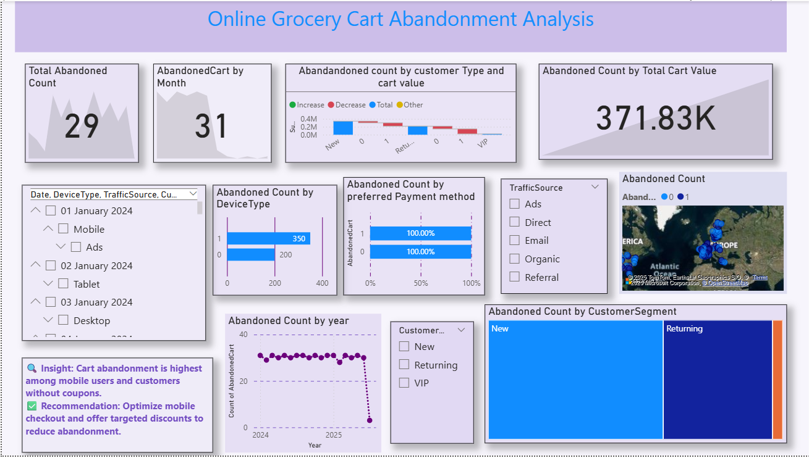

# 🛒 Online Grocery Cart Abandonment Analysis (Power BI)

This Power BI dashboard explores cart abandonment trends in an online grocery store. It analyzes how factors such as device type, payment methods, customer segments, traffic sources, and more contribute to cart abandonment. It provides valuable insights and recommendations to reduce abandonment rates and improve conversion.

## 📌 Objective
To identify and understand key factors influencing **cart abandonment** in online grocery shopping and recommend data-driven strategies to improve checkout completion rates.

## 🛠️ Tools & Technologies Used
- **Power BI Desktop**
- **DAX** for measure creation
- **CSV/Excel** data source
- **Geographical Map, Tree Map, Bar Charts, Line Graphs, and Cards**

## 📸 Dashboard Preview

## 📊 Key Metrics
- **Total Abandoned Carts:** 29  
- **Total Abandoned Cart Value:** 371.83K  
- **Monthly Abandonment Trend:** 31 abandoned in the latest month  
- **Most affected Customer Type:** Retail customers show both increases and decreases  
- **Highest Abandonment by Device:** Mobile (350 carts)  
- **Abandonment by Payment Method:** Two payment types equally contribute to 100% of abandoned carts  
- **Geographic Spread:** High activity from the US and Europe  
- **Top Segment Affected:** Returning customers (tree map)

## 🔍 Analysis Questions & Answers

| Question | Answer |
|---------|--------|
| How many total carts were abandoned? | 29 |
| What is the total cart value of abandoned carts? | ₹371.83K |
| Which month saw the highest cart abandonment? | Latest month had 31 carts abandoned |
| Which device type shows the highest abandonment? | Mobile (350 carts) |
| What customer type shows fluctuating abandonment patterns? | Retail |
| What segment of customers abandons carts the most? | Returning customers |
| Which payment methods contribute to cart abandonment? | Two payment types — both contribute equally (100%) |
| What insight is derived from device usage? | Mobile users without coupons abandon more |
| What recommendation is provided? | Optimize mobile checkout and offer targeted discounts |
| Are abandonment counts increasing or decreasing by year? | Stable through 2024, sudden drop in 2025 |
| Which traffic sources are tracked? | Ads, Direct, Organic, Referral |
| What regions show higher cart abandonment activity? | U.S. and parts of Europe |
| Does customer type influence cart value abandonment? | Yes, visible in grouped cart value bar chart |
| Are VIP customers abandoning carts too? | Yes, though in smaller numbers |
| Is abandonment analyzed by payment method? | Yes, with 100% rate observed for two methods |

## 💡 Insight & Recommendation
✅ **Insight:** Cart abandonment is highest among mobile users and customers who did not apply coupons.  
✅ **Recommendation:** Optimize the mobile checkout process and offer **targeted discounts** to reduce abandonment.

## 📬 Contact
If you'd like to learn more or collaborate, feel free to connect!

